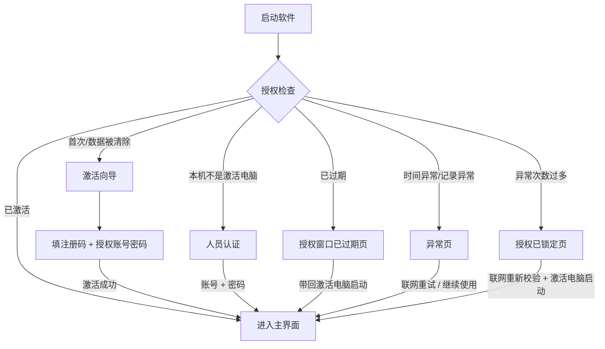
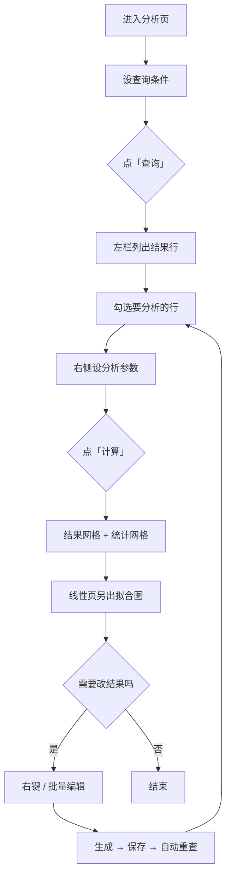
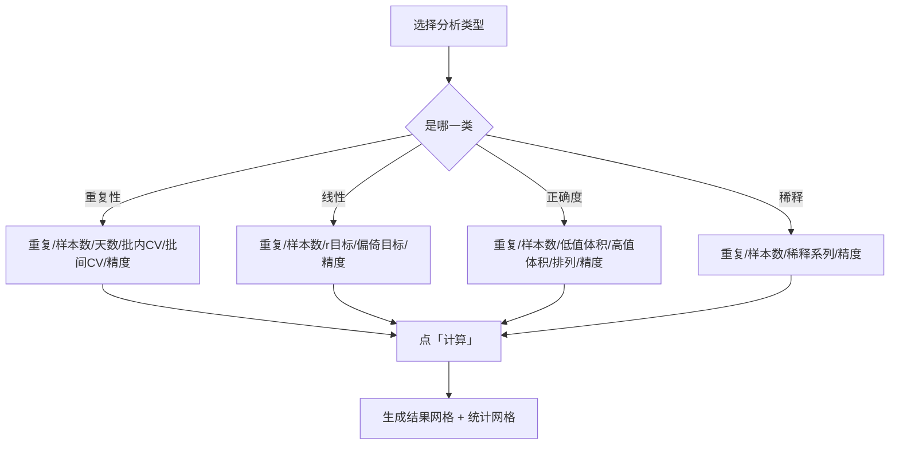
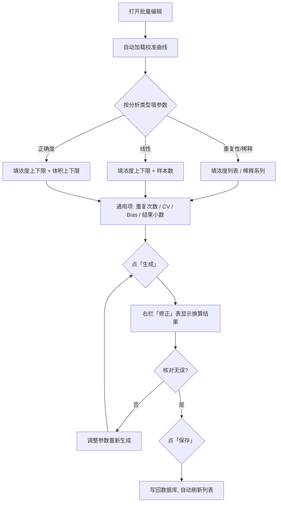
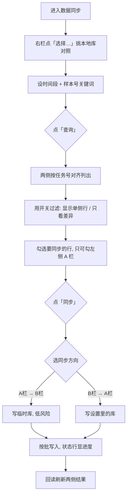

```mermaid
flowchart TD
    A[启动软件] --> B{授权检查}
    B -- 已激活 --> C[进入主界面]
    B -- 首次/数据被清除 --> D[激活向导]
    B -- 本机不是激活电脑 --> E[人员认证]
    B -- 已过期 --> F[授权窗口已过期页]
    B -- 时间异常/记录异常 --> G[异常页]
    B -- 异常次数过多 --> H[授权已锁定页]
    D --> I[填注册码 + 授权账号密码]
    I -->|激活成功| C
    E -->|账号 + 密码| C
    F -->|带回激活电脑启动| C
    G -->|联网重试 / 继续使用| C
    H -->|联网重新校验 + 激活电脑启动| C
```

```mermaid
flowchart TD
    A[进入分析页] --> B[设查询条件]
    B --> C{点「查询」}
    C --> D[左栏列出结果行]
    D --> E[勾选要分析的行]
    E --> F[右侧设分析参数]
    F --> G{点「计算」}
    G --> H[结果网格 + 统计网格]
    H --> I[线性页另出拟合图]
    I --> J{需要改结果吗}
    J -- 是 --> K[右键 / 批量编辑]
    K --> L[生成 → 保存 → 自动重查]
    L --> E
    J -- 否 --> M[结束]
```

```mermaid
flowchart TD
    A[选择分析类型] --> B{是哪一类}
    B -- 重复性 --> C[重复/样本数/天数/批内CV/批间CV/精度]
    B -- 线性 --> D[重复/样本数/r目标/偏倚目标/精度]
    B -- 正确度 --> E[重复/样本数/低值体积/高值体积/排列/精度]
    B -- 稀释 --> F[重复/样本数/稀释系列/精度]
    C --> G[点「计算」]
    D --> G
    E --> G
    F --> G
    G --> H[生成结果网格 + 统计网格]
```

```mermaid
flowchart TD
    A[打开批量编辑] --> B[自动加载校准曲线]
    B --> C{按分析类型填参数}
    C -- 重复性/稀释 --> D[填浓度列表 / 稀释系列]
    C -- 线性 --> E[填浓度上下限 + 样本数]
    C -- 正确度 --> F[填浓度上下限 + 体积上下限]
    D --> G[通用项: 重复次数 / CV / Bias / 结果小数]
    E --> G
    F --> G
    G --> H{点「生成」}
    H --> I[右栏「修正」表显示换算结果]
    I --> J{核对无误?}
    J -- 否 --> K[调整参数重新生成] --> H
    J -- 是 --> L{点「保存」}
    L --> M[写回数据库, 自动刷新列表]
```

```mermaid
flowchart TD
    A[进入数据同步] --> B[右栏点「选择…」挑本地库对照]
    B --> C[设时间段 + 样本号关键词]
    C --> D{点「查询」}
    D --> E[两侧按任务号对齐列出]
    E --> F[用开关过滤: 显示单侧行 / 只看差异]
    F --> G[勾选要同步的行, 只可勾左侧 A 栏]
    G --> H{点「同步」}
    H --> I{选同步方向}
    I -- A栏 → B栏 --> J[写临时库, 低风险]
    I -- B栏 → A栏 --> K[写设置里的库]
    J --> L[按批写入, 状态行显进度]
    K --> L
    L --> M[回读刷新两侧结果]
```
